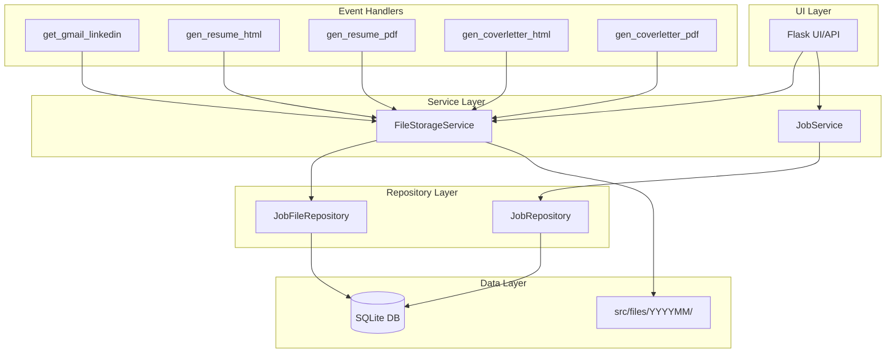

# Design Document: Database-Centric File Management

## Overview

This design transforms ResumAI from a filesystem-centric to a database-centric file management architecture. The core change introduces a new `job_files` table that serves as the single source of truth for all file locations, eliminating sync issues between the database and filesystem.

The architecture follows the existing repository/service pattern in the codebase, adding:
- A new `job_files` database table
- A `JobFileRepository` for data access
- A `FileStorageService` for coordinated file operations
- Updated event handlers and APIs to use job_id-based lookups

## Architecture



## Components and Interfaces

### 1. Database Schema Extension

Add the `job_files` table to `src/db/schema.sql`:

```sql
CREATE TABLE IF NOT EXISTS job_files (
    id INTEGER PRIMARY KEY AUTOINCREMENT,
    job_id INTEGER NOT NULL,
    filename TEXT NOT NULL,
    file_path TEXT NOT NULL,
    file_purpose TEXT NOT NULL,
    file_source TEXT NOT NULL,
    created_at TIMESTAMP DEFAULT CURRENT_TIMESTAMP,
    updated_at TIMESTAMP DEFAULT CURRENT_TIMESTAMP,
    UNIQUE(job_id, file_purpose),
    FOREIGN KEY (job_id) REFERENCES jobs(id) ON DELETE CASCADE
);

CREATE INDEX IF NOT EXISTS idx_job_files_job_id ON job_files(job_id);
CREATE INDEX IF NOT EXISTS idx_job_files_purpose ON job_files(file_purpose);
```

### 2. JobFile Data Model

Add to `src/db/models.py`:

```python
@dataclass
class JobFile:
    """File metadata record for a job."""
    job_id: int
    filename: str
    file_path: str
    file_purpose: str  # job_posting_html, resume_html, resume_pdf, coverletter_html, coverletter_pdf
    file_source: str   # url_fetch, generated
    id: Optional[int] = None
    created_at: Optional[datetime] = None
    updated_at: Optional[datetime] = None
```

### 3. JobFileRepository

New file `src/repositories/job_file_repository.py`:

```python
class JobFileRepository(BaseRepository):
    """Repository for job file metadata."""
    
    def create(self, job_file: JobFile) -> int:
        """Create a new file record."""
        
    def get_by_job_id(self, job_id: int) -> list[JobFile]:
        """Get all files for a job."""
        
    def get_by_job_and_purpose(self, job_id: int, file_purpose: str) -> Optional[JobFile]:
        """Get a specific file by job and purpose."""
        
    def exists(self, job_id: int, file_purpose: str) -> bool:
        """Check if a file record exists."""
        
    def delete(self, file_id: int) -> bool:
        """Delete a file record."""
        
    def delete_by_job_id(self, job_id: int) -> int:
        """Delete all file records for a job."""
```

### 4. FileStorageService

New file `src/services/file_storage_service.py`:

```python
class FileStorageService:
    """Service for coordinated file storage operations."""
    
    def __init__(self, base_path: Path = Path("src/files")):
        self.base_path = base_path
        self.file_repo = JobFileRepository()
    
    def store_file(
        self,
        job_id: int,
        content: bytes | str,
        file_purpose: str,
        file_source: str,
        extension: str
    ) -> JobFile:
        """Store a file and create database record atomically."""
        
    def get_file_path(self, job_id: int, file_purpose: str) -> Optional[Path]:
        """Get the filesystem path for a file."""
        
    def get_file_content(self, job_id: int, file_purpose: str) -> Optional[bytes | str]:
        """Read file content by job_id and purpose."""
        
    def delete_file(self, job_id: int, file_purpose: str) -> bool:
        """Delete a file from disk and database."""
        
    def get_files_for_job(self, job_id: int) -> list[JobFile]:
        """Get all file records for a job."""
        
    def _generate_partition_path(self) -> Path:
        """Generate YYYYMM partition folder path."""
        
    def _generate_unique_filename(self, job_id: int, purpose: str, extension: str) -> str:
        """Generate a unique filename."""
```

### 5. Updated Event Handlers

Event handlers will be modified to use `FileStorageService`:

**get_gmail_linkedin.py changes:**
- Remove job folder creation
- Remove job.yaml file writing
- Use `FileStorageService.store_file()` for job posting HTML
- Continue creating job records in database

**gen_resume_html.py changes:**
- Accept job_id instead of job_path
- Use `FileStorageService.store_file()` for output
- Query subcontent from database instead of filesystem

**gen_resume_pdf.py changes:**
- Accept job_id instead of job_path
- Get HTML path from `FileStorageService`
- Use `FileStorageService.store_file()` for PDF output

**gen_coverletter_html.py and gen_coverletter_pdf.py:**
- Similar changes as resume handlers

### 6. Updated API Endpoints

**File viewing endpoint changes:**

```python
# Old: /api/view/<job_folder_name>/<filename>
# New: /api/view/<int:job_id>/<file_purpose>

@app.route('/api/view/<int:job_id>/<file_purpose>')
def view_file(job_id: int, file_purpose: str):
    """Serve a file for viewing."""
    file_service = FileStorageService()
    file_record = file_service.file_repo.get_by_job_and_purpose(job_id, file_purpose)
    if not file_record:
        return jsonify({"error": "File not found"}), 404
    # ... serve file content
```

**Job detail endpoint changes:**

```python
@app.route('/api/job/<int:job_id>')
def get_job_detail(job_id: int):
    """Get job details with file information from database."""
    job_service = JobService()
    file_service = FileStorageService()
    
    job = job_service.get_job_by_id(job_id)
    files = file_service.get_files_for_job(job_id)
    
    # Build doc_status from database records
    doc_status = {
        "resume_html": any(f.file_purpose == "resume_html" for f in files),
        "resume_pdf": any(f.file_purpose == "resume_pdf" for f in files),
        "coverletter_html": any(f.file_purpose == "coverletter_html" for f in files),
        "coverletter_pdf": any(f.file_purpose == "coverletter_pdf" for f in files),
    }
```

## Data Models

### File Purpose Enumeration

Valid values for `file_purpose`:
- `job_posting_html` - HTML content fetched from job posting URL
- `resume_html` - Generated resume HTML document
- `resume_pdf` - Generated resume PDF document
- `coverletter_html` - Generated cover letter HTML document
- `coverletter_pdf` - Generated cover letter PDF document

### File Source Enumeration

Valid values for `file_source`:
- `url_fetch` - File content fetched from external URL
- `generated` - File generated by the system

### Partition Folder Naming

Partition folders use YYYYMM format:
- `src/files/202601/` for January 2026
- `src/files/202602/` for February 2026

### Unique Filename Generation

Filenames follow the pattern: `{job_id}_{purpose}_{uuid8}.{ext}`
- Example: `42_resume_html_a1b2c3d4.html`
- Example: `42_resume_pdf_e5f6g7h8.pdf`


## Correctness Properties

*A property is a characteristic or behavior that should hold true across all valid executions of a system—essentially, a formal statement about what the system should do. Properties serve as the bridge between human-readable specifications and machine-verifiable correctness guarantees.*

### Property 1: CASCADE Delete Removes File Records

*For any* job with associated file records in the Job_Files_Table, when the job is deleted from the jobs table, all associated file records shall be automatically deleted.

**Validates: Requirements 1.2, 1.4**

### Property 2: Unique Constraint Enforcement

*For any* job_id and file_purpose combination, attempting to create a second file record with the same combination shall fail with a constraint violation.

**Validates: Requirements 1.3**

### Property 3: File Storage Location Invariant

*For any* file stored via FileStorageService, the file_path shall match the pattern `src/files/YYYYMM/{filename}` where YYYYMM corresponds to the current year and month at storage time.

**Validates: Requirements 2.1, 2.2, 2.5**

### Property 4: Unique Filename Generation

*For any* two files stored via FileStorageService (even with the same job_id and purpose at different times), the generated filenames shall be different.

**Validates: Requirements 2.3**

### Property 5: Repository Round-Trip Consistency

*For any* valid JobFile record created via JobFileRepository.create(), retrieving it via get_by_job_and_purpose() with the same job_id and file_purpose shall return an equivalent record.

**Validates: Requirements 3.1, 3.3**

### Property 6: Repository Existence Check Accuracy

*For any* job_id and file_purpose, JobFileRepository.exists() shall return True if and only if a record with that combination exists in the database.

**Validates: Requirements 3.4, 3.6**

### Property 7: Atomic Store Operation

*For any* successful call to FileStorageService.store_file(), both the file shall exist on disk at the returned path AND a corresponding record shall exist in the Job_Files_Table.

**Validates: Requirements 7.1**

### Property 8: Atomic Delete Operation

*For any* successful call to FileStorageService.delete_file(), neither the file shall exist on disk NOR shall a corresponding record exist in the Job_Files_Table.

**Validates: Requirements 7.3**

### Property 9: Consistency on Failure

*For any* failed store operation (either disk write or database insert fails), there shall be no orphan files on disk without database records AND no orphan database records without files on disk.

**Validates: Requirements 7.4, 7.5**

### Property 10: API Database Lookup

*For any* file request to the view API with a valid job_id and file_purpose, the file content returned shall be read from the path stored in the Job_Files_Table, not from a hardcoded filesystem location.

**Validates: Requirements 6.2, 6.4**

### Property 11: API 404 on Missing Records

*For any* file request to the view API where no Job_Files_Table record exists for the given job_id and file_purpose, the API shall return a 404 status code.

**Validates: Requirements 6.3**

### Property 12: Job Detail File Completeness

*For any* job with file records in the Job_Files_Table, the job detail API response shall include all file records with their purpose, path, source, and timestamps.

**Validates: Requirements 8.1, 8.2, 8.3**

### Property 13: Inconsistency Detection

*For any* job where a Job_Files_Table record exists but the referenced file is missing from disk, the job detail API shall indicate this inconsistency in the response.

**Validates: Requirements 8.4**

## Error Handling

### Database Errors

1. **Connection failures**: All repository methods shall catch SQLite connection errors and raise a custom `DatabaseError` with context.

2. **Constraint violations**: Unique constraint violations on (job_id, file_purpose) shall raise `DuplicateFileError` with the conflicting record details.

3. **Foreign key violations**: Attempts to create file records for non-existent jobs shall raise `JobNotFoundError`.

### File System Errors

1. **Permission errors**: File write failures due to permissions shall raise `FilePermissionError` and trigger cleanup of any partial database records.

2. **Disk space errors**: Out of disk space errors shall raise `StorageFullError` and trigger cleanup.

3. **Missing files**: When a database record exists but the file is missing, `get_file_content()` shall raise `FileInconsistencyError`.

### Atomic Operation Failures

1. **Partial store failure**: If file write succeeds but database insert fails, the written file shall be deleted before raising the error.

2. **Partial delete failure**: If database delete succeeds but file delete fails, the operation shall log a warning but not roll back the database change (file can be cleaned up later).

### API Error Responses

| Error Condition | HTTP Status | Response Body |
|----------------|-------------|---------------|
| Job not found | 404 | `{"error": "Job not found", "job_id": <id>}` |
| File record not found | 404 | `{"error": "File not found", "job_id": <id>, "purpose": "<purpose>"}` |
| File missing from disk | 500 | `{"error": "File inconsistency", "job_id": <id>, "purpose": "<purpose>", "expected_path": "<path>"}` |
| Database error | 500 | `{"error": "Database error", "details": "<message>"}` |

## Testing Strategy

### Unit Tests

Unit tests will verify specific examples and edge cases:

1. **Schema tests**: Verify table structure, constraints, and indexes exist
2. **Repository method tests**: Test each CRUD method with valid and invalid inputs
3. **Service method tests**: Test FileStorageService methods in isolation with mocked dependencies
4. **API endpoint tests**: Test each endpoint with various inputs and expected responses

### Property-Based Tests

Property-based tests will use the `hypothesis` library (already in the project) to verify universal properties:

1. **Configuration**: Each property test shall run minimum 100 iterations
2. **Tagging**: Each test shall be tagged with format `Feature: database-centric-file-management, Property N: <property_text>`
3. **Generators**: Custom generators for JobFile records, file content, and job_id values

### Integration Tests

1. **Email fetch workflow**: End-to-end test of fetching jobs and verifying file storage
2. **Document generation workflow**: End-to-end test of generating documents and verifying storage
3. **API workflow**: End-to-end test of storing files and retrieving via API

### Test Data Strategy

- Tests shall NOT use production database
- Tests shall use a temporary SQLite database created per test session
- Tests shall use a temporary directory for file storage
- Tests shall clean up all created files and database records after completion
