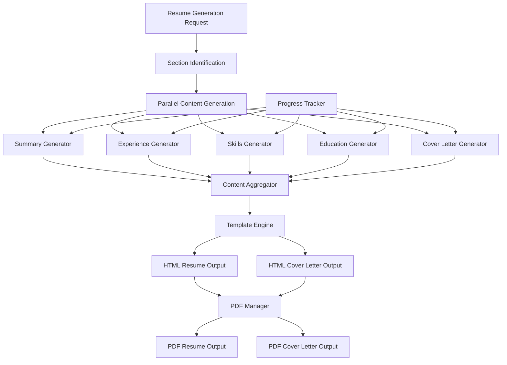
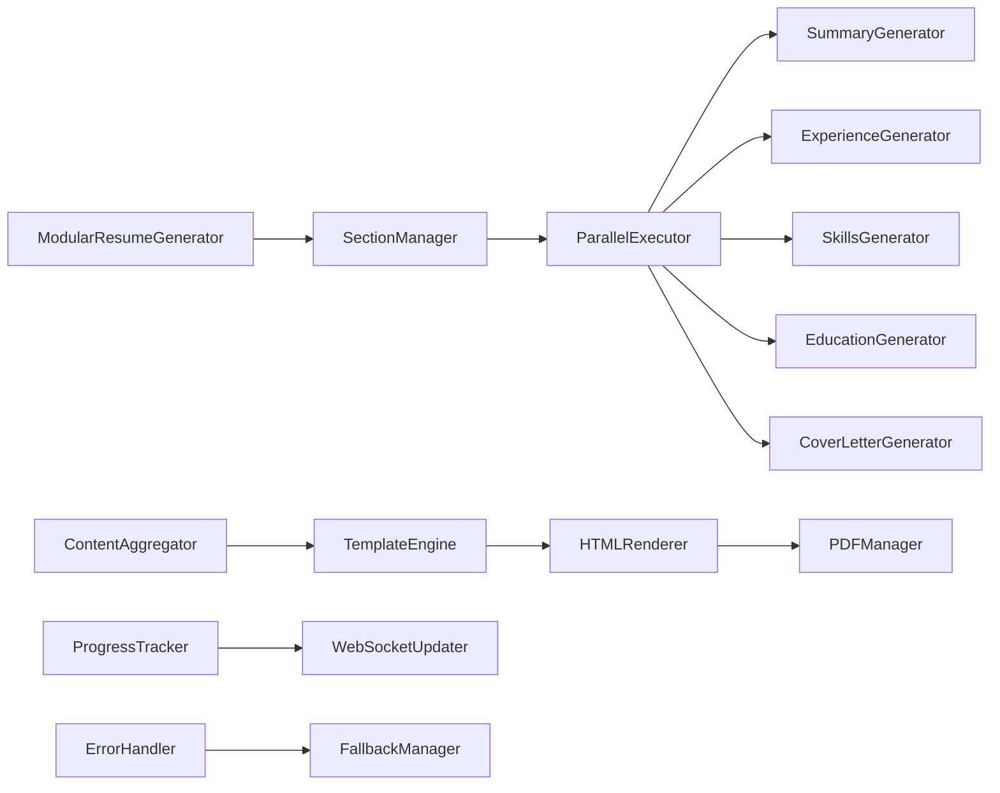

# Design Document

## Overview

The modular resume generation system transforms the current monolithic approach into a parallel, section-based architecture. Instead of generating complete HTML resumes in single LLM calls, the system will:

1. **Generate structured content** for each resume section (summary, experience, skills, etc.) in parallel
2. **Return YAML/JSON** instead of HTML to reduce tokens and improve speed
3. **Merge content into templates** using a dedicated template engine
4. **Provide real-time progress** tracking for each section
5. **Handle failures gracefully** with section-level fallbacks

This approach addresses current timeout issues, reduces token costs, and improves maintainability.

## Architecture

### Folder Structure Integration

The modular system integrates with the reorganized folder structure:

```
src/
├── jobs/                    # Job processing (same as before)
├── logs/                    # Logging (same as before)  
├── resources/               # All output resources
│   ├── css/                # Stylesheets for HTML output
│   ├── icons/              # SVG icons for contact info
│   ├── fonts/              # Font files for PDF generation
│   └── templates/          # HTML templates for resume/cover letter
├── resumes/                # Resume YAML files (same as before)
├── ui/                     # Web interface (same as before)
├── utils/                  # Utility modules and classes
│   ├── modular_generator.py    # Main modular generation logic
│   ├── section_generators.py   # Individual section generators
│   ├── template_engine.py      # Template rendering engine
│   ├── content_aggregator.py   # Section result aggregation
│   ├── parallel_executor.py    # Concurrent execution manager
│   └── pdf_manager.py          # PDF generation (moved from root)
└── step2_generate.py       # Main execution script (updated to use modular system)
```

### Template Location Update

Templates are now centralized in `src/resources/templates/`:
- `src/resources/templates/resume.html` - Resume template
- `src/resources/templates/cover_letter.html` - Cover letter template
- `src/resources/templates/base.html` - Shared base template (if needed)

### High-Level Flow



### Component Architecture



## Components and Interfaces

### 1. ModularResumeGenerator

**Purpose**: Main orchestrator for the modular generation process

**Interface**:
```python
class ModularResumeGenerator:
    def generate_resume(self, resume_data: dict, job_data: dict) -> dict:
        """Generate resume using modular approach"""
        
    def generate_resume_legacy(self, resume_data: dict, job_data: dict) -> str:
        """Fallback to original monolithic generation"""
        
    def get_generation_progress(self, job_id: str) -> dict:
        """Get real-time progress for job"""
```

### 2. SectionManager

**Purpose**: Identifies and manages resume sections for parallel processing

**Interface**:
```python
class SectionManager:
    def identify_sections(self, resume_data: dict) -> List[SectionConfig]:
        """Identify sections to generate based on resume data"""
        
    def create_section_generators(self, sections: List[SectionConfig]) -> List[SectionGenerator]:
        """Create appropriate generators for each section"""
```

### Section Types**:
- Professional Summary (min 580, max 630 characters)
- Selected Achievements (5 bullets, each with min 300 characters, max 350 characters)
- Core Skills (12 skills split into 3 columns and 4 rows, each skill min 20, max 36 characters)
- Experience (company descriptions + role bullets, each bullet is either [min 90 and max 115 characters], OR [min 180 and max 240 characters])
- Education (course + school only)
- Awards & Speaking (title only)
- **Cover Letter Content** (professional letter body, min 1100 and max 1500 characters)

All character counts include whitespace and punctuation.

### 3. ParallelExecutor

**Purpose**: Executes multiple section generators concurrently

**Interface**:
```python
class ParallelExecutor:
    def execute_parallel(self, generators: List[SectionGenerator]) -> Dict[str, Any]:
        """Execute section generators in parallel with timeout handling"""
        
    def execute_with_progress(self, generators: List[SectionGenerator], 
                            progress_callback: Callable) -> Dict[str, Any]:
        """Execute with real-time progress updates"""
```

### 4. Section Generators

**Purpose**: Generate structured content for specific resume sections

**Base Interface**:
```python
class SectionGenerator:
    def generate_content(self, resume_data: dict, job_data: dict) -> dict:
        """Generate structured content for this section"""
        
    def get_prompt_template(self) -> str:
        """Get LLM prompt template for this section"""
        
    def validate_content(self, content: dict) -> bool:
        """Validate generated content structure"""
```

**Specific Generators**:
- `SummaryGenerator`: Professional summary tailored to job
- `ExperienceGenerator`: Company descriptions and role bullets
- `SkillsGenerator`: 12 most relevant skills in 3 columns
- `EducationGenerator`: Education entries without dates
- `AwardsGenerator`: Awards and keynotes without dates
- `CoverLetterGenerator`: Professional letter content tailored to job

### 5. ContentAggregator

**Purpose**: Combines section results into complete resume data structure

**Interface**:
```python
class ContentAggregator:
    def aggregate_sections(self, section_results: Dict[str, Any]) -> dict:
        """Combine section results into complete resume structure"""
        
    def handle_missing_sections(self, resume_data: dict, 
                              section_results: Dict[str, Any]) -> dict:
        """Fill in missing sections with fallback content"""
```

### 8. UIFeedbackManager

**Purpose**: Provides comprehensive, real-time feedback to users during all generation processes

**Interface**:
```python
class UIFeedbackManager:
    def __init__(self, update_interval: float = 5.0):
        """Initialize with maximum 5-second update intervals"""
        
    def start_job_tracking(self, job_id: str, batch_id: str = None) -> None:
        """Begin tracking a job with optional batch context"""
        
    def update_phase(self, job_id: str, phase: str, status: str) -> None:
        """Update current phase (job_preparation, content_generation, etc.)"""
        
    def update_section_progress(self, job_id: str, section: str, 
                              progress: float, status: str) -> None:
        """Update individual section progress"""
        
    def get_progress_update(self, job_id: str) -> dict:
        """Get current progress for UI polling"""
        
    def broadcast_batch_progress(self, batch_id: str) -> None:
        """Send batch-level progress updates"""
```

**Update Frequency**:
- **Minimum every 5 seconds** for active processes
- **Immediate updates** for phase transitions, completions, and errors
- **Real-time updates** for section completions and failures
- **Batch progress** updated as individual jobs complete

**Purpose**: Converts generated HTML resume and cover letter to PDF format using resources from `src/resources/`

**Interface**:
```python
class PDFManager:
    def __init__(self, resources_dir: str = "src/resources"):
        """Initialize with resources directory for CSS, fonts, icons"""
        
    def convert_modular_output(self, html_files: List[str]) -> Dict[str, str]:
        """Convert HTML files generated by modular system to PDF"""
        
    def validate_pdf_generation(self, html_content: str) -> bool:
        """Validate that HTML content can be successfully converted to PDF"""
```

### 7. PDFManager Integration

**Purpose**: Converts generated HTML resume and cover letter to PDF format using resources from `src/resources/`

**Interface**:
```python
class PDFManager:
    def __init__(self, resources_dir: str = "src/resources"):
        """Initialize with resources directory for CSS, fonts, icons"""
        
    def convert_modular_output(self, html_files: List[str], 
                             progress_callback: Callable = None) -> Dict[str, str]:
        """Convert HTML files with progress updates"""
        
    def validate_pdf_generation(self, html_content: str) -> bool:
        """Validate that HTML content can be successfully converted to PDF"""
```

**Integration Points**:
- Called after template engine generates HTML files
- Uses CSS from `src/resources/css/` for styling
- Accesses icons from `src/resources/icons/` for contact info
- Uses fonts from `src/resources/fonts/` for PDF rendering
- **Reports progress** for each file conversion
- Handles both resume and cover letter conversion

### 6. TemplateEngine

**Purpose**: Merges structured content into HTML templates from `src/resources/templates/`

**Interface**:
```python
class TemplateEngine:
    def __init__(self, template_dir: str = "src/resources/templates"):
        """Initialize with template directory"""
        
    def render_resume(self, content_data: dict, template_name: str = "resume.html") -> str:
        """Render structured content into HTML resume"""
        
    def render_cover_letter(self, content_data: dict, job_data: dict, 
                          template_name: str = "cover_letter.html") -> str:
        """Render cover letter using structured content"""
        
    def load_template(self, template_name: str) -> Template:
        """Load HTML template from src/resources/templates/"""
```

## Data Models

### Section Content Structure

For content structure templates, see:
- Candidate Resume Template: `src/resources/templates/CandidateFirst_LastName.yaml`
- Job Description Template: `src/resources/templates/20251229140000.0000000000.company.job.yaml`


### Progress Tracking Structure

```json
{
  "job_id": "4323850902",
  "batch_id": "batch_20260109_001", 
  "batch_position": "2/5",
  "overall_status": "generating_content",
  "current_phase": "content_generation",
  "phases": {
    "job_preparation": {"status": "completed", "duration": 0.5},
    "content_generation": {"status": "in_progress", "duration": null},
    "template_rendering": {"status": "pending", "duration": null},
    "pdf_conversion": {"status": "pending", "duration": null}
  },
  "sections": {
    "summary": {"status": "completed", "duration": 2.3},
    "skills": {"status": "in_progress", "duration": null, "progress": 0.7},
    "experience": {"status": "pending", "duration": null},
    "education": {"status": "completed", "duration": 1.1},
    "awards": {"status": "completed", "duration": 0.8},
    "cover_letter": {"status": "failed", "error": "timeout", "duration": 5.0, "retry_count": 1}
  },
  "overall_progress": 0.45,
  "estimated_completion": "2026-01-09T17:15:30Z",
  "last_update": "2026-01-09T17:12:15Z",
  "next_update_in": 3.2
}
```

## Correctness Properties

*A property is a characteristic or behavior that should hold true across all valid executions of a system-essentially, a formal statement about what the system should do. Properties serve as the bridge between human-readable specifications and machine-verifiable correctness guarantees.*

<function_calls>
<invoke name="prework">
<parameter name="featureName">modular-resume-generation

### Property Reflection

After reviewing all testable criteria, several properties can be consolidated:
- Properties 1.1, 2.1, and 5.2 all relate to parallel section processing and can be combined
- Properties 3.2, 3.4, and 6.1 all relate to content validation and fallback handling
- Properties 7.1, 7.2, and 7.4 all relate to progress tracking and can be unified
- Properties 6.3 and 6.4 both relate to failure handling and can be combined

### Converting EARS to Properties

Property 1: Parallel section generation
*For any* resume generation request, the system should create multiple concurrent LLM requests for different sections rather than a single monolithic request
**Validates: Requirements 1.1, 2.1, 5.2**

Property 2: Structured content format
*For any* section generation response, the content should be valid YAML or JSON without HTML markup
**Validates: Requirements 1.2, 4.2, 5.1**

Property 3: Non-blocking section processing  
*For any* section completion event, other sections should continue processing without waiting
**Validates: Requirements 1.3, 2.3**

Property 4: Template engine assembly
*For any* complete set of structured sections, the template engine should produce valid HTML output
**Validates: Requirements 1.4, 3.3, 4.3**

Property 5: Content validation and fallback
*For any* invalid or missing section content, the system should validate structure and use appropriate fallback content
**Validates: Requirements 3.2, 3.4, 6.1**

Property 6: Performance improvement
*For any* resume generation using parallel processing, completion time should be significantly less than sequential processing
**Validates: Requirements 2.2, 5.4**

Property 7: Fault isolation and recovery
*For any* section failure or timeout, the system should isolate the failure and continue with other sections or fall back to legacy generation
**Validates: Requirements 6.2, 6.3, 6.4**

Property 8: Real-time progress tracking
*For any* active section generation, the system should provide real-time progress updates for each individual section
**Validates: Requirements 7.1, 7.2, 7.3, 7.4**

Property 9: Template independence
*For any* HTML template change, the content generation prompts should remain unchanged
**Validates: Requirements 4.1, 4.4**

Property 10: PDF generation compatibility
*For any* HTML resume and cover letter generated by the modular system, the existing PDF generation process should successfully convert them to PDF format
**Validates: Requirements 8.1, PDF Integration**

Property 12: Comprehensive UI feedback
*For any* active generation process, the system should provide status updates at least every 5 seconds and immediate updates for phase transitions
**Validates: Requirements 9.1, 9.2, 9.5, 10.5**

Property 13: Multi-phase progress visibility
*For any* job processing workflow, the system should clearly indicate current phase and provide realistic progress estimates across all phases
**Validates: Requirements 10.1, 10.2, 10.3, 10.4, 10.6**

Property 11: Backward compatibility
*For any* existing API request, the system should maintain compatibility and provide fallback to legacy generation when needed
**Validates: Requirements 8.1, 8.2, 8.3, 8.4**

## Error Handling

### Section-Level Error Handling
- **Timeout Handling**: Individual section timeouts (30 seconds) don't affect other sections
- **Content Validation**: Invalid YAML/JSON triggers fallback to original resume content
- **LLM Errors**: API errors for one section don't block others
- **Retry Logic**: Failed sections can be retried individually up to 2 times

### System-Level Error Handling
- **Complete Failure**: If all sections fail, automatically fall back to legacy monolithic generation
- **Partial Failure**: Mix successful and failed sections, use original content for failed sections
- **Template Errors**: Template rendering failures trigger error logging and fallback HTML
- **Progress Tracking**: Errors in progress updates don't affect generation process

### Fallback Hierarchy
1. **Section Retry**: Retry failed section up to 2 times
2. **Original Content**: Use content from original resume for failed section
3. **Legacy Generation**: Fall back to monolithic generation if too many sections fail
4. **Error Response**: Return error if all approaches fail

## Testing Strategy

### Dual Testing Approach
The system requires both unit tests and property-based tests for comprehensive coverage:

**Unit Tests** focus on:
- Individual section generator functionality (including cover letter)
- Template engine rendering with specific inputs
- PDF generation compatibility with modular HTML output
- UI feedback manager update frequency and accuracy
- Multi-phase progress tracking accuracy
- Batch vs single job progress reporting
- Error handling for known failure scenarios
- API endpoint compatibility

**Property-Based Tests** focus on:
- Universal properties across all resume and cover letter generation requests (Properties 1-14)
- Comprehensive input coverage through randomization
- Parallel processing behavior validation
- Content format validation across all section types (including cover letter)
- PDF generation success across all modular outputs
- UI feedback timing and consistency across all process types
- Multi-phase progress accuracy under various conditions
- Performance characteristics under various loads

### Property Test Configuration
- **Minimum 100 iterations** per property test due to randomization
- **Concurrent execution testing** with multiple parallel sections
- **Failure injection testing** to validate error handling properties
- **Performance benchmarking** to validate speed improvements

Each property test must reference its design document property using the tag format:
**Feature: modular-resume-generation, Property {number}: {property_text}**

### Testing Framework
- **Property-Based Testing Library**: Use `hypothesis` for Python property-based testing
- **Concurrency Testing**: Use `asyncio` and `concurrent.futures` for parallel execution testing
- **Performance Testing**: Use `pytest-benchmark` for timing comparisons
- **Mock Testing**: Mock LLM responses for consistent testing

### UI Feedback Requirements

- **Maximum 5-second intervals** between progress updates during active processes
- **Immediate updates** for phase transitions, errors, and completions
- **Batch progress display** showing both overall batch status and individual job details
- **Phase indicators** for job preparation, content generation, template rendering, and PDF conversion
- **Section-level progress** with individual completion status and timing
- **Error messaging** with clear descriptions and retry options
- **Completion notifications** with next action suggestions

The testing strategy ensures both specific functionality (unit tests) and universal correctness (property tests) while validating the core benefits of the modular approach: speed, reliability, maintainability, and comprehensive user feedback.