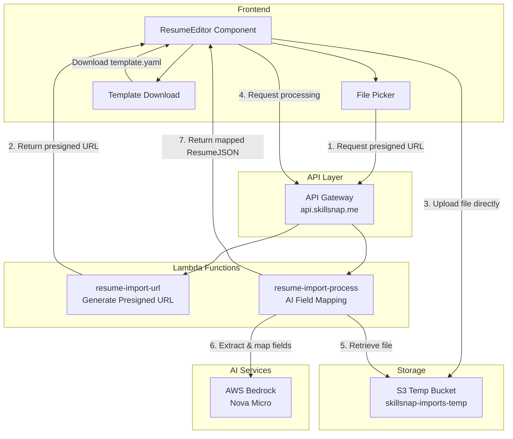

# Design Document: Resume File Import

## Overview

The Resume File Import feature extends SkillSnap's resume management capabilities by allowing users to import resume data from external files (YAML, JSON, PDF) directly into the Create/Edit Resume screen. The feature leverages Amazon Bedrock Nova Micro for AI-powered field mapping, ensuring that even unstructured resume formats can be intelligently converted to SkillSnap's internal ResumeJSON structure.

### Key Design Decisions

1. **S3 Temp Storage with Lifecycle**: Uploaded files are stored temporarily in S3 with a 60-second lifecycle policy, ensuring automatic cleanup while providing enough time for processing
2. **Presigned URL Upload**: Files are uploaded directly to S3 using presigned URLs, reducing API Gateway payload limits and Lambda processing overhead
3. **Nova Micro for Field Mapping**: Reuses the existing Bedrock integration pattern from resume generation, maintaining consistency across AI features
4. **Client-Side Template**: The YAML template is bundled with the webapp, eliminating the need for an additional API endpoint
5. **Synchronous Processing**: Given the expected file sizes (<5MB) and processing time (<30s), synchronous Lambda processing is used rather than SQS queuing

## Architecture



### Request Flow

1. **Upload Initiation**:
   - User clicks "Load from File" → File picker opens
   - User selects file → Frontend validates type and size
   - Frontend requests presigned URL from `POST /resumes/import/url`
   - Lambda generates presigned URL with 60-second expiry
   - Frontend uploads file directly to S3 using presigned URL

2. **Processing Flow**:
   - Frontend calls `POST /resumes/import/process` with S3 key
   - Lambda retrieves file from S3
   - For YAML/JSON: Parse directly
   - For PDF: Extract text using PyPDF2
   - Send content + ResumeJSON schema to Nova Micro
   - Validate response against ResumeJSON schema
   - Return mapped data to frontend

3. **Template Download**:
   - User clicks "Download Template"
   - Frontend triggers download of bundled `skillsnap-resume-template.yaml`
   - No backend interaction required

## Components and Interfaces

### Frontend Components

#### ResumeEditor Updates

```
ResumeEditor (existing)
├── Header
│   ├── Title ("Create Resume" / "Edit Resume")
│   └── Close Button
├── Form Content
│   ├── Resume Name Row (MODIFIED)
│   │   ├── Resume Name Input (shortened width)
│   │   ├── LoadFromFileButton (NEW)
│   │   │   ├── Upload Icon
│   │   │   └── "Load from File" text
│   │   └── DownloadTemplateButton (NEW)
│   │       ├── Download Icon
│   │       └── "Download Template" text
│   ├── ImportProgressOverlay (NEW, conditional)
│   │   ├── Spinner
│   │   └── "Analyzing resume file..." text
│   └── ... existing form fields ...
└── Footer
    ├── Cancel Button
    └── Save Button
```

#### New Component: ImportProgressOverlay

```typescript
interface ImportProgressOverlayProps {
  isVisible: boolean;
}

// Renders a semi-transparent overlay with centered spinner and text
// Prevents interaction with underlying form while visible
```

### Backend Components

#### New Lambda Functions

| Function | Trigger | Purpose |
|----------|---------|---------|
| `resume-import-url` | API | Generate presigned S3 URL for file upload |
| `resume-import-process` | API | Process uploaded file and return mapped ResumeJSON |

#### New API Endpoints

```
POST /resumes/import/url
  Request: { filename: string, contentType: string }
  Response: { uploadUrl: string, s3Key: string }

POST /resumes/import/process
  Request: { s3Key: string }
  Response: { resumejson: ResumeJSON, warnings?: string[] }
```

### S3 Configuration

#### New Bucket: skillsnap-imports-temp

```python
# Lifecycle configuration
lifecycle_rules = [
    {
        "id": "delete-temp-imports",
        "status": "Enabled",
        "expiration": { "days": 1 },  # Minimum is 1 day for lifecycle
        "prefix": "temp-imports/"
    }
]

# Note: For 60-second cleanup, we'll delete in Lambda after processing
```

### AI Prompt Design

The AI maps from the input file format (matching `stephen_hilton.yaml` structure) to the internal ResumeJSON format used by SkillSnap.

#### Field Mapping Reference

| Input File Field | Internal ResumeJSON Field |
|------------------|---------------------------|
| `name` | `contact.name` |
| `location` | `contact.location` |
| `contacts[].name` | (used for icon mapping) |
| `contacts[].label` | `contact.items[].title` |
| `contacts[].url` | `contact.items[].url` |
| `contacts[].icon` | `contact.items[].icon` (mapped to internal icon names) |
| `summary` | `summary` |
| `skills[]` | `skills[]` |
| `experience[].company_name` | `experience[].name` |
| `experience[].company_urls` | `experience[].url` |
| `experience[].employees` | `experience[].employees` |
| `experience[].dates` | `experience[].startDate`, `experience[].endDate`, `experience[].current` |
| `experience[].location` | `experience[].location` |
| `experience[].company_description` | `experience[].description` |
| `experience[].roles[].role` | `experience[].roles[].title` |
| `experience[].roles[].dates` | `experience[].roles[].startDate`, `experience[].roles[].endDate`, `experience[].roles[].current` |
| `experience[].roles[].bullets[]` | `experience[].roles[].bullets[]` |
| `education[].course` | `education[].degree` |
| `education[].school` | `education[].institution` |
| `education[].dates` | `education[].graduationDate` |
| `awards[].award` | `awards[].title` |
| `awards[].reward` | `awards[].description` |
| `awards[].dates` | `awards[].date` |
| `keynotes[].keynote` | `keynotes[].title` |
| `keynotes[].event` | `keynotes[].event` |
| `keynotes[].dates` | `keynotes[].date` |

#### Field Mapping Prompt Template

```
You are a resume data extraction assistant. Extract information from the following resume content and map it to the specified JSON schema.

RESUME CONTENT:
{file_content}

TARGET SCHEMA (ResumeJSON):
{resumejson_schema}

FIELD MAPPING RULES:
1. Map top-level "name" to contact.name
2. Map top-level "location" to contact.location  
3. Map "contacts" array to contact.items, converting icon filenames to internal icon names
4. Map "experience" with company_name/roles structure to the internal experience format
5. Parse date ranges like "January 2020 - Present" into startDate/endDate/current fields
6. Map education course/school/dates to degree/institution/graduationDate
7. Map awards award/reward/dates to title/description/date
8. Map keynotes keynote/event/dates to title/event/date
9. Do NOT include highlights - they are AI-generated separately
10. If a field cannot be determined, use an empty string or empty array

Return ONLY valid JSON matching the ResumeJSON schema, no additional text.

OUTPUT:
```

## Data Models

### API Request/Response Types

```typescript
// POST /resumes/import/url request
interface ImportUrlRequest {
  filename: string;      // Original filename
  contentType: string;   // MIME type (application/json, application/x-yaml, application/pdf)
}

// POST /resumes/import/url response
interface ImportUrlResponse {
  uploadUrl: string;     // Presigned S3 URL for PUT
  s3Key: string;         // S3 key for subsequent processing request
  expiresIn: number;     // URL expiry in seconds (60)
}

// POST /resumes/import/process request
interface ImportProcessRequest {
  s3Key: string;         // S3 key from upload step
}

// POST /resumes/import/process response
interface ImportProcessResponse {
  resumejson: ResumeJSON;  // Mapped resume data
  warnings?: string[];     // Optional warnings about unmapped fields
  source: 'yaml' | 'json' | 'pdf';  // Detected source format
}
```

### Template File Structure

The template follows the same structure as `stephen_hilton.yaml`, which is the expected input format for resume files. The AI will map this structure to the internal ResumeJSON format.

```yaml
# SkillSnap Resume Template
# Fill in your information and import using "Load from File".
# This format matches the expected resume file structure.

name: Your Full Name                    # Required: Your professional name
location: City, State/Country           # Optional: Your location

summary: |
  Your professional summary goes here. This should be 2-4 sentences
  highlighting your key experience, skills, and career objectives.

contacts:                               # List of contact methods
  - name: Email                         # Contact type name
    label: your.email@example.com       # Display text
    url: mailto:your.email@example.com  # Link URL
    icon: at-solid.svg                  # Icon filename
  - name: Mobile
    label: (555) 123-4567
    url: tel:+15551234567
    icon: phone-volume-solid.svg
  - name: LinkedIn
    label: linkedin.com/in/yourprofile
    url: https://linkedin.com/in/yourprofile
    icon: linkedin-brands-solid.svg
  - name: GitHub
    label: github.com/yourusername
    url: https://github.com/yourusername
    icon: github-brands.svg
  - name: Webpage
    label: yourwebsite.com
    url: https://yourwebsite.com
    icon: globe-solid.svg
  # Icon options: at-solid.svg, phone-volume-solid.svg, linkedin-brands-solid.svg,
  # github-brands.svg, globe-solid.svg, house-solid.svg, telegram-brands.svg

skills:
  - Skill 1
  - Skill 2
  - Skill 3

# Note: highlights are NOT included - they are always AI-generated
# based on your experience data during resume generation.

experience:
  - company_name: Company Name
    company_urls: https://company.com   # Can be string or array of URLs
    employees: 1000                     # Optional: number of employees
    dates: January 2020 - Present       # Date range for company tenure
    location: City, State               # Optional
    company_description: |              # Optional: brief company description
      Brief description of what the company does.
    
    roles:
      - role: Job Title
        dates: January 2022 - Present
        location: City, State           # Optional
        bullets:
          - text: Achievement or responsibility description
            tags: [leadership, technical]  # Optional tags for AI matching
          - text: Another achievement or responsibility
            tags: []

  - company_name: Previous Company
    company_urls:
      - https://company.com
      - https://alternate-url.com
    employees: 500
    dates: 2015 - 2020
    location: Another City, State
    company_description: Description of previous company.
    
    roles:
      - role: Senior Role Title
        dates: 2018 - 2020
        location: City, State
        bullets:
          - text: Key achievement in senior role
            tags: [management]
      - role: Junior Role Title
        dates: 2015 - 2018
        location: City, State
        bullets:
          - text: Achievement in junior role
            tags: []

education:
  - course: Degree or Certification Name
    school: Institution Name
    dates: 2018                         # Graduation year or date range
  - course: Another Certification
    school: Training Provider
    dates: 2020

awards:
  - award: Award Title
    reward: Prize or recognition received  # Optional
    dates: 2023
  - award: Another Award
    reward: Description of reward
    dates: 2020

keynotes:                               # Optional: speaking engagements
  - keynote: Presentation Title
    event: Conference or Event Name
    dates: 2023
```

### File Validation Rules

| Check | YAML/JSON | PDF |
|-------|-----------|-----|
| Max file size | 5MB | 5MB |
| MIME type | application/json, application/x-yaml, text/yaml | application/pdf |
| Extension | .json, .yaml, .yml | .pdf |
| Content validation | Valid syntax | Valid PDF structure |


## Correctness Properties

*A property is a characteristic or behavior that should hold true across all valid executions of a system—essentially, a formal statement about what the system should do. Properties serve as the bridge between human-readable specifications and machine-verifiable correctness guarantees.*

### Property 1: File Validation Rejects Invalid Inputs

*For any* file selected by the user, if the file size exceeds 5MB OR the file extension is not one of (.yaml, .yml, .json, .pdf), the system SHALL reject the file with an appropriate error message and NOT proceed with upload.

**Validates: Requirements 2.3, 2.4, 2.5**

### Property 2: Upload Produces Valid Unique S3 Key

*For any* successful file upload, the returned S3 key SHALL match the pattern `temp-imports/{userid}/{timestamp}-{filename}` AND be unique across all uploads (no two uploads produce the same key).

**Validates: Requirements 4.1, 4.2, 4.5**

### Property 3: Authentication Enforcement

*For any* request to the upload or process endpoints without a valid Cognito token, the system SHALL return a 401 Unauthorized response and NOT process the request.

**Validates: Requirements 4.4**

### Property 4: Supported File Types Parse Successfully

*For any* valid YAML file, the parser SHALL produce a JavaScript object. *For any* valid JSON file, the parser SHALL produce a JavaScript object. *For any* valid PDF file with text content, the extractor SHALL produce a non-empty string.

**Validates: Requirements 5.2, 5.3**

### Property 5: AI Response Produces Valid ResumeJSON

*For any* AI response from Nova Micro, the Import_Lambda SHALL either return a valid ResumeJSON object (passing schema validation) OR return a ResumeJSON with default values for any fields the AI could not map.

**Validates: Requirements 5.5, 5.7**

### Property 6: Invalid Files Return Descriptive Errors

*For any* file that cannot be parsed (corrupted YAML, invalid JSON syntax, unreadable PDF), the Import_Lambda SHALL return an error response containing a descriptive message indicating the parsing failure.

**Validates: Requirements 5.6**

### Property 7: Successful Import Populates All Form Fields

*For any* successful import response containing a ResumeJSON object, the frontend SHALL populate every corresponding form field with the mapped data, with no fields left in their previous state.

**Validates: Requirements 6.1**

### Property 8: Error Preserves Existing Form Data

*For any* import error response, the frontend SHALL preserve all existing form field values exactly as they were before the import was initiated.

**Validates: Requirements 6.6**

### Property 9: Template Round-Trip Mapping

*For any* file created by filling in the template YAML with valid data, importing that file SHALL produce a ResumeJSON where every field matches the input data with 100% accuracy (no data loss or transformation errors).

**Validates: Requirements 7.3, 7.5**

### Property 10: MIME Type Validation

*For any* file upload request, if the declared content type does not match the file extension (e.g., claiming PDF but uploading YAML), the system SHALL reject the upload with an error.

**Validates: Requirements 9.1**

### Property 11: Input Sanitization

*For any* text extracted from uploaded files, before sending to Nova Micro, the system SHALL remove or escape potentially harmful content (script tags, SQL injection patterns, prompt injection attempts).

**Validates: Requirements 9.5**

## Error Handling

### Frontend Errors

| Error Scenario | User Message | Technical Action |
|----------------|--------------|------------------|
| File too large (>5MB) | "File is too large. Please select a file under 5MB." | Reject before upload, log warning |
| Unsupported file type | "Unsupported file type. Please select a YAML, JSON, or PDF file." | Reject before upload, log warning |
| Network error during upload | "Upload failed. Please check your connection and try again." | Retry once, then show error |
| Session expired | "Session expired. Please refresh the page and try again." | Redirect to login |
| Processing timeout (>60s) | "Processing took too long. Please try a smaller file or simpler format." | Cancel request, show error |

### Backend Errors

| Error Scenario | HTTP Status | Response |
|----------------|-------------|----------|
| Missing auth token | 401 | `{"error": "Unauthorized", "message": "Authentication required"}` |
| Invalid auth token | 401 | `{"error": "Unauthorized", "message": "Invalid or expired token"}` |
| File not found in S3 | 404 | `{"error": "NotFound", "message": "File not found or expired"}` |
| Invalid file format | 400 | `{"error": "ValidationError", "message": "Could not parse file", "details": [...]}` |
| MIME type mismatch | 400 | `{"error": "ValidationError", "message": "File type does not match extension"}` |
| Bedrock timeout | 504 | `{"error": "Timeout", "message": "AI processing timed out"}` |
| Bedrock error | 500 | `{"error": "InternalError", "message": "Failed to process resume"}` |

### Error Recovery

1. **Upload Failures**: Frontend retries once automatically, then shows error with retry button
2. **Processing Failures**: Frontend shows error message, preserves form state, allows retry
3. **Partial AI Results**: Backend fills missing fields with defaults, frontend shows warnings
4. **S3 Cleanup**: Files are deleted after processing (success or failure) to prevent orphans

## Testing Strategy

### Dual Testing Approach

This feature uses both unit tests and property-based tests for comprehensive coverage:

- **Unit tests**: Verify specific examples, edge cases, integration points, and error conditions
- **Property tests**: Verify universal properties across randomly generated inputs

### Property-Based Testing Configuration

- **Library**: Hypothesis (Python) for Lambda functions, fast-check (TypeScript) for React components
- **Minimum iterations**: 100 per property test
- **Tag format**: `Feature: resume-file-import, Property {number}: {property_text}`

### Test Categories

#### Unit Tests

1. **Frontend - File Selection**
   - File picker opens on button click
   - Accept attribute filters file types correctly
   - Size validation rejects files >5MB
   - Type validation rejects unsupported extensions

2. **Frontend - Upload Flow**
   - Progress indicator appears during upload
   - Buttons disabled during processing
   - Modal close prevented during processing
   - Form populated on success
   - Error displayed on failure
   - Form preserved on error

3. **Frontend - Template Download**
   - Download triggered on button click
   - Correct filename provided
   - Template contains all ResumeJSON fields

4. **Backend - Presigned URL Generation**
   - Valid URL returned for valid request
   - S3 key follows expected pattern
   - Auth required

5. **Backend - File Processing**
   - YAML parsing works for valid files
   - JSON parsing works for valid files
   - PDF text extraction works
   - Schema validation catches invalid AI responses
   - Defaults applied for missing fields

6. **Backend - Security**
   - MIME type validation
   - Input sanitization
   - Auth enforcement

#### Property-Based Tests

Each correctness property above SHALL be implemented as a single property-based test with minimum 100 iterations.

Key property test implementations:

1. **Property 1 (File Validation)**: Generate random file sizes and extensions, verify accept/reject behavior
2. **Property 2 (S3 Key)**: Generate multiple uploads, verify uniqueness and format
3. **Property 4 (Parsing)**: Generate valid YAML/JSON/PDF content, verify successful parsing
4. **Property 5 (AI Response)**: Generate various AI responses, verify schema validation and defaults
5. **Property 9 (Template Round-Trip)**: Generate valid resume data, fill template, import, verify equality

### Integration Tests

1. **End-to-end upload flow**: Select file → Upload to S3 → Process → Verify form populated
2. **Template round-trip**: Download template → Fill with data → Import → Verify data matches
3. **Error recovery**: Trigger various errors → Verify form state preserved → Retry succeeds

### Test Environment

- **Local**: LocalStack for S3, pytest for Python Lambdas, Vitest for React
- **CI/CD**: GitHub Actions with LocalStack containers
- **Mocking**: Mock Bedrock responses for deterministic testing
