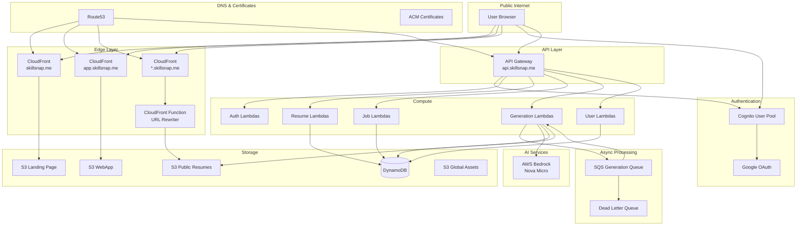

# Design Document: Skillsnap MVP

## Overview

Skillsnap is a serverless web application that automates bespoke resume generation for job seekers. The system follows an event-driven architecture using AWS services to ensure cost-effective scaling proportional to user growth.

The application consists of:
- **Landing Page**: Static marketing site at skillsnap.me
- **WebApp**: React SPA at app.skillsnap.me for authenticated users
- **API Layer**: REST API at api.skillsnap.me backed by Lambda functions
- **AI Engine**: AWS Bedrock Nova Micro for content generation
- **Storage**: DynamoDB for structured data, S3 for files
- **CDN**: CloudFront for static assets and custom resume URLs

### Key Design Decisions

1. **Serverless-First**: All compute uses Lambda to ensure pay-per-use pricing
2. **Single-Table Design Avoided**: Multiple DynamoDB tables for clarity and enforcing uniqueness constraints
3. **SQS over EventBridge**: Simpler async processing for the straightforward workflow
4. **CloudFront Functions**: Edge-based URL rewriting for custom resume domains
5. **React + Tailwind + shadcn/ui**: Modern, accessible UI with professional aesthetic

## Architecture



### Request Flow

1. **Authentication Flow**:
   - User visits skillsnap.me → CloudFront serves static landing page
   - User clicks Login → Redirected to Cognito hosted UI
   - User authenticates (Google OAuth or email/password)
   - Cognito issues JWT tokens → User redirected to app.skillsnap.me

2. **Job Creation Flow**:
   - User clicks "Add Job" → API Gateway validates token
   - Lambda scrapes job URL or fetches Gmail alerts
   - Job data stored in JOB table, USER_JOB created with phase "Search"
   - WebApp displays new job card

3. **Generation Flow**:
   - User can click "Generate All" to queue all 8 subcomponents, OR click individual subcomponent generate buttons one at a time
   - For each subcomponent, generation type determines behavior:
     - **AI mode**: Lambda sends resume + job description to Bedrock Nova Micro, which generates tailored content optimized for ATS
     - **Manual mode**: Lambda structures the corresponding resume section JSON into lean HTML (no inline styles, styling handled by CSS)
   - Results stored in USER_JOB data fields (datacontact, datasummary, etc.)
   - WebApp polls for status updates
   - User can regenerate any subcomponent at any time by clicking its generate button again

4. **Final File Flow**:
   - User triggers final generation → Lambda aggregates subcomponents
   - HTML generated, PDF converted
   - Files uploaded to S3 at /{username}/{company}/{jobtitlesafe}/
   - USER_JOB s3loc fields updated
   - Custom URL becomes active via CloudFront Function

## Components and Interfaces

### Frontend Components

#### Landing Page (skillsnap.me)
- Static HTML/CSS/JS hosted on S3
- Hero section with value proposition
- Feature highlights
- Login/Signup CTA button
- Responsive design with Tailwind CSS

#### WebApp (app.skillsnap.me)

```
┌─────────────────────────────────────────────────────────────────┐
│ Header                                                          │
│ [Logo] [Nav] [Resume ▼] [Profile ▼]                            │
├──────────────┬──────────────────────────────────────────────────┤
│ Sidebar      │ Main Content                                     │
│              │                                                   │
│ [+ Add Job ▼]│ ┌─────────────────────────────────────────────┐  │
│              │ │ Job Card 1                                  │  │
│ Phases:      │ │ Company | Title | Phase | Age | Location    │  │
│ ○ Search (3) │ │ ─────────────────────────────────────────── │  │
│ ○ Queued (5) │ │ Subcomponents:                              │  │
│ ○ Generating │ │ [▶️🧠 Contact] [▶️🧠 Experience]            │  │
│ ○ Ready (2)  │ │ [▶️🧠 Summary] [▶️🧠 Education]             │  │
│ ○ Applied    │ │ [▶️🧠 Skills]  [▶️🧠 Awards]                │  │
│ ○ Follow-Up  │ │ [▶️🧠 Highlights] [▶️🧠 Cover Letter]       │  │
│ ○ Negotiation│ │ ─────────────────────────────────────────── │  │
│ ○ Accepted   │ │ Final Files:                                │  │
│ ○ Skipped    │ │ [🔒 Resume.html] [🔒 CoverLetter.html]      │  │
│ ○ Expired    │ │ [🔒 Resume.pdf]  [🔒 CoverLetter.pdf]       │  │
│ ○ Errored    │ └─────────────────────────────────────────────┘  │
│              │                                                   │
│ ───────────  │ ┌─────────────────────────────────────────────┐  │
│ All Active   │ │ Job Card 2...                               │  │
│ All Jobs     │ └─────────────────────────────────────────────┘  │
└──────────────┴──────────────────────────────────────────────────┘
```

**React Component Hierarchy**:
```
App
├── AuthProvider (Cognito context)
├── Header
│   ├── Logo
│   ├── Navigation
│   ├── ResumeSelector (dropdown: user resumes + Add Resume option)
│   └── UserProfile (dropdown: Settings, Logs, Logout)
├── Sidebar
│   ├── AddJobButton (dropdown: Gmail, URL, Manual)
│   ├── PhaseFilters
│   └── PhaseAggregations
└── MainContent
    └── JobCardList
        └── JobCard (repeated)
            ├── JobCardHeader
            ├── SubcomponentGrid
            │   └── SubcomponentRow (x8)
            │       ├── GenerationStateIcon
            │       ├── GenerationTypeToggle
            │       └── TitleLink
            └── FinalFileGrid
                └── FinalFileRow (x4)
                    ├── GenerationStateIcon
                    └── TitleLink
```

### Backend Components

#### Lambda Functions

| Function | Trigger | Purpose |
|----------|---------|---------|
| `auth-post-confirmation` | Cognito | Create USER record on signup |
| `auth-pre-token` | Cognito | Add custom claims to JWT |
| `resume-create` | API | Create new resume |
| `resume-get` | API | Get resume by id |
| `resume-update` | API | Update resume JSON |
| `resume-delete` | API | Delete resume |
| `resume-list` | API | List user's resumes |
| `job-create-url` | API | Create job from URL |
| `job-create-gmail` | API | Fetch jobs from Gmail |
| `job-create-manual` | API | Create job manually |
| `job-get` | API | Get job details |
| `job-list` | API | List user's jobs with filters |
| `job-update-phase` | API | Update job phase |
| `job-delete` | API | Delete job |
| `gen-subcomponent` | SQS | Generate single subcomponent |
| `gen-final-html` | API | Generate final HTML files |
| `gen-final-pdf` | API | Generate final PDF files |
| `user-prefs-get` | API | Get user preferences |
| `user-prefs-update` | API | Update user preferences |

#### API Endpoints

```
POST   /auth/gmail-connect     # Initiate Gmail OAuth
GET    /auth/gmail-callback    # Gmail OAuth callback

GET    /resumes                # List resumes
POST   /resumes                # Create resume
GET    /resumes/{id}           # Get resume
PUT    /resumes/{id}           # Update resume
DELETE /resumes/{id}           # Delete resume

GET    /jobs                   # List jobs (with phase filter)
POST   /jobs/url               # Create from URL
POST   /jobs/gmail             # Create from Gmail
POST   /jobs/manual            # Create manually
GET    /jobs/{id}              # Get job details
PUT    /jobs/{id}/phase        # Update phase
DELETE /jobs/{id}              # Delete job

POST   /jobs/{id}/generate-all           # Queue all subcomponents
POST   /jobs/{id}/generate/{component}   # Generate single subcomponent
GET    /jobs/{id}/status                 # Get generation status

POST   /jobs/{id}/final/resume-html      # Generate resume HTML
POST   /jobs/{id}/final/resume-pdf       # Generate resume PDF
POST   /jobs/{id}/final/cover-html       # Generate cover letter HTML
POST   /jobs/{id}/final/cover-pdf        # Generate cover letter PDF

GET    /preferences            # Get user preferences
PUT    /preferences            # Update preferences
```

### CloudFront Function (URL Rewriter)

```javascript
function handler(event) {
  var request = event.request;
  var headers = request.headers;
  var host = headers.host && headers.host.value ? headers.host.value : "";
  host = host.split(":")[0].toLowerCase();

  var username = "www";
  var parts = host.split(".");
  if (parts.length >= 3) username = parts[0];

  var uri = request.uri || "/";
  if (uri === "") uri = "/";

  // Global assets: DO NOT rewrite
  if (
    uri.indexOf("/assets/") === 0 ||
    uri.indexOf("/_global/") === 0 ||
    uri === "/favicon.ico" ||
    uri === "/robots.txt" ||
    uri === "/sitemap.xml"
  ) {
    return request;
  }

  // User root -> user homepage
  if (uri === "/") {
    request.uri = "/" + username + "/index.html";
    return request;
  }

  // Normalize trailing slash
  if (uri.length > 1 && uri.charAt(uri.length - 1) === "/") {
    uri = uri.slice(0, -1);
  }

  var segs = uri.split("/").filter(Boolean);

  // "/company/job" -> "/username/company/job/index.html"
  if (segs.length === 2) {
    request.uri = "/" + username + "/" + segs[0] + "/" + segs[1] + "/index.html";
    return request;
  }

  // Anything deeper: prefix username
  request.uri = "/" + username + uri;
  return request;
}
```

## Data Models

### DynamoDB Tables

#### USER Table
```typescript
interface User {
  userid: string;        // PK: uuid7
  userhandle: string;    // Display name
  email: string;         // User's email
  username: string;      // Login username
  cognitoSub: string;    // Cognito user sub
  gmailConnected: boolean;
  gmailRefreshToken?: string;  // Encrypted
  createdAt: string;     // ISO timestamp
  updatedAt: string;     // ISO timestamp
}
```

#### USER_EMAIL Table
```typescript
interface UserEmail {
  useremail: string;     // PK: email address
  userid: string;        // FK to USER
}
```

#### USER_USERNAME Table
```typescript
interface UserUsername {
  username: string;      // PK: username
  userid: string;        // FK to USER
}
```

#### USER_PREF Table
```typescript
interface UserPref {
  userid: string;        // PK: FK to USER
  prefname: string;      // SK: preference name
  prefvalue: string;     // Preference value
}

// Preference names:
// - default_gen_contact: "static" | "ai"
// - default_gen_summary: "static" | "ai"
// - default_gen_skills: "static" | "ai"
// - default_gen_highlights: "static" | "ai"
// - default_gen_experience: "static" | "ai"
// - default_gen_education: "static" | "ai"
// - default_gen_awards: "static" | "ai"
// - default_gen_coverletter: "static" | "ai"
```

#### JOB Table
```typescript
interface Job {
  jobid: string;         // PK: uuid7
  postedts: string;      // Posting source timestamp
  jobcompany: string;    // Company name
  joblistid?: string;    // External listing ID
  jobtitle: string;      // Job title
  jobtitlesafe: string;  // URL-safe title
  jobdesc: string;       // Full description
  joblocation?: string;  // Location
  jobsalary?: string;    // Salary info
  jobposteddate: string; // ISO date
  joburl?: string;       // Original posting URL
  jobcompanylogo?: string; // Logo URL
  jobtags: string[];     // Tags array
  createdAt: string;     // ISO timestamp
}
```

#### USER_JOB Table
```typescript
interface UserJob {
  userid: string;        // PK: FK to USER
  jobid: string;         // SK: FK to JOB
  resumeid: string;      // FK to RESUME used for generation
  jobphase: JobPhase;    // Current phase
  
  // Subcomponent data (HTML)
  datacontact?: string;
  datasummary?: string;
  dataskills?: string;
  datahighlights?: string;
  dataexperience?: string;
  dataeducation?: string;
  dataawards?: string;
  datacoverletter?: string;
  
  // Generation states
  statecontact: GenerationState;
  statesummary: GenerationState;
  stateskills: GenerationState;
  statehighlights: GenerationState;
  stateexperience: GenerationState;
  stateeducation: GenerationState;
  stateawards: GenerationState;
  statecoverletter: GenerationState;
  
  // Generation types
  typecontact: GenerationType;
  typesummary: GenerationType;
  typeskills: GenerationType;
  typehighlights: GenerationType;
  typeexperience: GenerationType;
  typeeducation: GenerationType;
  typeawards: GenerationType;
  typecoverletter: GenerationType;
  
  // Final file locations
  s3locresumehtml?: string;
  s3locresumepdf?: string;
  s3loccoverletterhtml?: string;
  s3loccoverletterpdf?: string;
  
  createdAt: string;
  updatedAt: string;
}

type JobPhase = 
  | "Search" | "Queued" | "Generating" | "Ready" 
  | "Applied" | "Follow-Up" | "Negotiation" | "Accepted"
  | "Skipped" | "Expired" | "Errored";

type GenerationState = "locked" | "ready" | "generating" | "complete" | "error";
type GenerationType = "manual" | "ai";
```

#### RESUME Table
```typescript
interface Resume {
  userid: string;        // PK: FK to USER
  resumename: string;    // SK: resume name
  resumejson: ResumeJSON; // Full resume data
  lastupdate: string;    // ISO timestamp
}

interface ResumeJSON {
  contact: {
    name: string;
    email: string;
    phone?: string;
    location?: string;
    linkedin?: string;
    website?: string;
  };
  summary: string;
  skills: string[];
  highlights: string[];
  experience: {
    company: string;
    title: string;
    startDate: string;
    endDate?: string;
    current: boolean;
    description: string;
    achievements: string[];
  }[];
  education: {
    institution: string;
    degree: string;
    field: string;
    graduationDate: string;
    gpa?: string;
  }[];
  awards: {
    title: string;
    issuer: string;
    date: string;
    description?: string;
  }[];
}
```

#### RESUME_URL Table
```typescript
interface ResumeUrl {
  resumeurl: string;     // PK: full URL
  userid: string;        // FK to USER
  jobid: string;         // FK to JOB
  createdAt: string;     // ISO timestamp
}
```

### S3 Bucket Structure

```
skillsnap-landing/
├── index.html
├── assets/
│   ├── css/
│   ├── js/
│   └── images/

skillsnap-webapp/
├── index.html
├── static/
│   ├── css/
│   ├── js/
│   └── media/

skillsnap-public-resumes/
├── assets/
│   ├── resume-base.css
│   └── cover-base.css
├── {username}/
│   ├── index.html (user homepage)
│   └── {company}/
│       └── {jobtitlesafe}/
│           ├── index.html (resume)
│           ├── resume.html
│           ├── resume.pdf
│           ├── coverletter.html
│           ├── coverletter.pdf
│           └── resume-override.css (optional)
```

### SQS Message Schema

```typescript
interface GenerationMessage {
  userid: string;
  jobid: string;
  resumeid: string;
  component: SubcomponentType;
  generationType: GenerationType;
  timestamp: string;
}

type SubcomponentType = 
  | "contact" | "summary" | "skills" | "highlights"
  | "experience" | "education" | "awards" | "coverletter";
```


## Correctness Properties

*A property is a characteristic or behavior that should hold true across all valid executions of a system—essentially, a formal statement about what the system should do. Properties serve as the bridge between human-readable specifications and machine-verifiable correctness guarantees.*

### Property 1: OAuth Account Linking Consistency

*For any* Google OAuth authentication response with an email address, if a user with that email already exists in USER_EMAIL, the system SHALL link to the existing account; otherwise, it SHALL create a new USER record and corresponding USER_EMAIL entry.

**Validates: Requirements 1.2**

### Property 2: Authentication Token Refresh

*For any* valid authentication session, the system SHALL refresh tokens before they expire, ensuring continuous authenticated access without requiring re-login.

**Validates: Requirements 1.7**

### Property 3: Unauthenticated Request Rejection

*For any* request to the WebApp or API without a valid Cognito token, the system SHALL redirect to login (WebApp) or return 401 Unauthorized (API).

**Validates: Requirements 3.2, 14.2, 14.5**

### Property 4: Phase Filter Accuracy

*For any* set of jobs and any selected phase filter, the displayed job cards SHALL contain exactly the jobs matching that phase, with no jobs from other phases included.

**Validates: Requirements 3.6**

### Property 5: All Jobs Filter Completeness

*For any* set of jobs belonging to a user, selecting "All Jobs" SHALL display every job regardless of phase, with the count matching the total number of user jobs.

**Validates: Requirements 3.8**

### Property 6: Resume CRUD Round-Trip

*For any* valid resume JSON, creating a resume then retrieving it SHALL return an equivalent resume object with matching userid, resumename, and resumejson content.

**Validates: Requirements 4.1, 4.2**

### Property 7: Resume JSON Schema Validation

*For any* resume JSON input, the validation function SHALL accept inputs conforming to the ResumeJSON schema and reject inputs that violate required fields or type constraints.

**Validates: Requirements 4.4**

### Property 8: Resume Deletion Completeness

*For any* resume deletion request, after deletion the resume SHALL no longer be retrievable by userid and resumename.

**Validates: Requirements 4.5**

### Property 9: Job Creation with UUID7

*For any* job creation request (from Gmail, URL, or manual), the system SHALL generate a valid uuid7 for jobid that is unique and time-ordered.

**Validates: Requirements 5.4**

### Property 10: Job Creation Initial Phase

*For any* newly created job, the USER_JOB record SHALL have jobphase set to "Search" and all generation states set to "locked" or "ready" based on dependencies.

**Validates: Requirements 5.5, 12.2**

### Property 11: Job Data Extraction Completeness

*For any* job created from URL or Gmail, the extracted data SHALL include non-empty values for jobcompany, jobtitle, and jobtitlesafe at minimum.

**Validates: Requirements 5.6**

### Property 12: Job Card Display Completeness

*For any* job card rendering, the output SHALL include company name, job title, phase indicator, and posting age; optional fields (location, salary, source, tags) SHALL be displayed when present.

**Validates: Requirements 6.1**

### Property 13: Posting Age Calculation

*For any* job with a jobposteddate, the posting age SHALL equal the number of days between jobposteddate and current date, rounded to the nearest integer.

**Validates: Requirements 6.3**

### Property 14: Phase Update Persistence

*For any* phase change request with a valid phase value, the USER_JOB.jobphase SHALL be updated in DynamoDB and subsequent reads SHALL return the new phase.

**Validates: Requirements 6.5, 12.6**

### Property 15: Generation State Machine

*For any* subcomponent, the generation state SHALL transition only through valid paths: locked → ready → generating → complete (or error), and locked state SHALL prevent generation triggers.

**Validates: Requirements 7.2, 7.3**

### Property 16: Generation Type Toggle

*For any* subcomponent generation type toggle action, the type SHALL switch between "manual" and "ai", and the new type SHALL be persisted in USER_JOB.

**Validates: Requirements 7.7**

### Property 17: Generate All Queue Count

*For any* "Generate All" action, exactly 8 SQS messages SHALL be queued, one for each subcomponent (contact, summary, skills, highlights, experience, education, awards, coverletter).

**Validates: Requirements 7.8, 16.1**

### Property 18: AI Generation Input Composition

*For any* AI generation request (generation type = "ai"), the prompt sent to Bedrock SHALL contain both the user's base resume content and the job description.

**Validates: Requirements 8.2**

### Property 19: Manual Generation Structure

*For any* manual generation request (generation type = "manual"), the output SHALL be lean HTML structured from the corresponding resume section JSON, containing no inline styles.

**Validates: Requirements 9.3**

### Property 20: Generation Output HTML Validity

*For any* successful AI or manual generation, the stored content SHALL be valid HTML that can be parsed without errors.

**Validates: Requirements 8.4**

### Property 21: Generation Content Storage

*For any* completed subcomponent generation, the content SHALL be stored in the corresponding USER_JOB data field (datacontact, datasummary, etc.) and the state SHALL be "complete".

**Validates: Requirements 7.5, 8.5**

### Property 22: Editor Cancel No-Persist

*For any* editor cancel action, the content in USER_JOB SHALL remain unchanged from before the editor was opened.

**Validates: Requirements 9.4**

### Property 23: Final File Enable Condition

*For any* job, final file generation buttons SHALL be enabled if and only if all 8 subcomponent states are "complete".

**Validates: Requirements 10.1**

### Property 24: Resume HTML Aggregation

*For any* resume HTML generation, the output SHALL contain content from all subcomponents: contact, summary, skills, highlights, experience, education, and awards.

**Validates: Requirements 10.2**

### Property 25: PDF Generation Round-Trip

*For any* HTML to PDF conversion, the generated PDF SHALL be a valid PDF file that, when rendered, displays content equivalent to the source HTML.

**Validates: Requirements 10.3, 10.5**

### Property 26: Final File S3 Path

*For any* final file upload, the S3 key SHALL follow the pattern /{username}/{company}/{jobtitlesafe}/{filename} where filename is one of: resume.html, resume.pdf, coverletter.html, coverletter.pdf.

**Validates: Requirements 10.6**

### Property 27: S3 Location Field Update

*For any* successful file upload, the corresponding USER_JOB s3loc field SHALL be updated with the full S3 URI, and subsequent reads SHALL return this URI.

**Validates: Requirements 10.7**

### Property 28: CloudFront URL Rewriting

*For any* request to {username}.skillsnap.me/{company}/{jobtitlesafe}, the CloudFront function SHALL rewrite the path to /{username}/{company}/{jobtitlesafe}/index.html in S3.

**Validates: Requirements 11.1, 11.2**

### Property 29: CloudFront Global Asset Passthrough

*For any* request path starting with /assets/, /_global/, or matching /favicon.ico, /robots.txt, /sitemap.xml, the CloudFront function SHALL NOT modify the path.

**Validates: Requirements 11.3**

### Property 30: CloudFront Override CSS Rewriting

*For any* request to {username}.skillsnap.me/{company}/{jobtitlesafe}/resume-override.css, the CloudFront function SHALL rewrite to /{username}/{company}/{jobtitlesafe}/resume-override.css in S3.

**Validates: Requirements 11.4**

### Property 31: Resume URL Uniqueness

*For any* resume URL creation, the URL SHALL be stored in RESUME_URL table, and attempting to create a duplicate URL SHALL fail or return the existing record.

**Validates: Requirements 11.5**

### Property 32: Generated HTML Global CSS Links

*For any* generated resume or cover letter HTML, the document SHALL include link tags referencing /assets/resume-base.css or /assets/cover-base.css respectively.

**Validates: Requirements 11.6**

### Property 33: Valid Phase Values

*For any* phase value stored or accepted by the system, it SHALL be one of the 11 valid phases: Search, Queued, Generating, Ready, Applied, Follow-Up, Negotiation, Accepted, Skipped, Expired, Errored.

**Validates: Requirements 12.1**

### Property 34: Automatic Phase Transitions

*For any* job, phase SHALL automatically transition: to "Queued" when data gathering completes, to "Generating" when generation starts, to "Ready" when all files are complete.

**Validates: Requirements 12.3, 12.4, 12.5**

### Property 35: Job Expiration

*For any* job with jobposteddate more than 30 days ago and phase not in (Accepted, Skipped, Expired), the system SHALL transition phase to "Expired".

**Validates: Requirements 12.7**

### Property 36: User Preference Storage

*For any* user preference update, the preference SHALL be stored in USER_PREF with the correct userid (PK) and prefname (SK), and subsequent reads SHALL return the updated value.

**Validates: Requirements 13.1, 13.4**

### Property 37: Default Generation Type Preference

*For any* subcomponent default preference, the prefname SHALL follow the pattern default_gen_{subcomponent} where subcomponent is one of: contact, summary, skills, highlights, experience, education, awards, coverletter.

**Validates: Requirements 13.2**

### Property 38: New Job Preference Application

*For any* new job creation, the initial generation types for all subcomponents SHALL match the user's stored default preferences, or "ai" if no preference is set.

**Validates: Requirements 13.3**

### Property 39: API Status Code Accuracy

*For any* API response, the HTTP status code SHALL accurately reflect the outcome: 200/201 for success, 400 for bad request, 401 for unauthorized, 404 for not found, 500 for server error.

**Validates: Requirements 14.4**

### Property 40: Email Uniqueness Enforcement

*For any* user registration with an email that already exists in USER_EMAIL, the registration SHALL fail with an appropriate error message.

**Validates: Requirements 15.2**

### Property 41: Username Uniqueness Enforcement

*For any* user registration with a username that already exists in USER_USERNAME, the registration SHALL fail with an appropriate error message.

**Validates: Requirements 15.3**

### Property 42: Async Queue Immediate Return

*For any* operation that queues work to SQS, the API SHALL return immediately with a pending/accepted status without waiting for processing to complete.

**Validates: Requirements 16.2**

### Property 43: SQS Processing Status Update

*For any* SQS message successfully processed by a Lambda, the corresponding USER_JOB generation state SHALL be updated to reflect the processing result.

**Validates: Requirements 16.3**

## Error Handling

### Authentication Errors

| Error | Handling |
|-------|----------|
| Invalid credentials | Display error message, allow retry, log attempt |
| Expired token | Automatically refresh; if refresh fails, redirect to login |
| Google OAuth failure | Display error, offer email/password alternative |
| Gmail scope denied | Continue without Gmail integration, inform user |

### API Errors

| Error | HTTP Status | Response |
|-------|-------------|----------|
| Missing auth token | 401 | `{"error": "Unauthorized", "message": "Authentication required"}` |
| Invalid auth token | 401 | `{"error": "Unauthorized", "message": "Invalid or expired token"}` |
| Resource not found | 404 | `{"error": "NotFound", "message": "Resource not found"}` |
| Validation error | 400 | `{"error": "ValidationError", "message": "...", "details": [...]}` |
| Rate limit exceeded | 429 | `{"error": "RateLimited", "message": "Too many requests"}` |
| Internal error | 500 | `{"error": "InternalError", "message": "An error occurred"}` |

### Generation Errors

| Error | Handling |
|-------|----------|
| Bedrock timeout | Retry up to 3 times with exponential backoff |
| Bedrock rate limit | Queue for retry after delay |
| Invalid resume data | Mark generation as error, display message to user |
| PDF conversion failure | Retry once, then mark as error |
| S3 upload failure | Retry up to 3 times, then mark as error |

### Data Errors

| Error | Handling |
|-------|----------|
| DynamoDB throttling | Retry with exponential backoff |
| Duplicate email | Return 409 Conflict with message |
| Duplicate username | Return 409 Conflict with message |
| Invalid resume JSON | Return 400 with validation errors |

### SQS Error Handling

- Failed messages retry according to queue visibility timeout
- After max retries, messages move to Dead Letter Queue (DLQ)
- DLQ messages trigger CloudWatch alarm for manual review
- Lambda logs include correlation IDs for tracing

## Testing Strategy

### Dual Testing Approach

This project uses both unit tests and property-based tests for comprehensive coverage:

- **Unit tests**: Verify specific examples, edge cases, integration points, and error conditions
- **Property tests**: Verify universal properties across randomly generated inputs

### Property-Based Testing Configuration

- **Library**: Hypothesis (Python) for Lambda functions, fast-check (TypeScript) for React components
- **Minimum iterations**: 100 per property test
- **Tag format**: `Feature: skillsnap-mvp, Property {number}: {property_text}`

### Test Categories

#### Unit Tests

1. **Authentication**
   - Login redirect to Cognito
   - Token validation
   - Gmail OAuth scope verification

2. **Resume Management**
   - CRUD operations with specific examples
   - Schema validation edge cases (missing fields, wrong types)
   - Delete confirmation

3. **Job Management**
   - Job creation from each source type
   - Phase transitions
   - Filter combinations

4. **Generation**
   - Subcomponent state transitions
   - HTML output structure
   - PDF generation

5. **CloudFront Function**
   - Specific URL patterns
   - Edge cases (trailing slashes, special characters)

#### Property-Based Tests

Each correctness property above SHALL be implemented as a single property-based test with minimum 100 iterations.

Key property test implementations:

1. **Property 4 (Phase Filter)**: Generate random jobs with random phases, apply filter, verify only matching jobs returned
2. **Property 6 (Resume Round-Trip)**: Generate random valid resume JSON, create/retrieve, verify equivalence
3. **Property 7 (Schema Validation)**: Generate both valid and invalid resume JSON, verify accept/reject
4. **Property 13 (Posting Age)**: Generate random dates, calculate age, verify correct day count
5. **Property 17 (Generate All)**: Trigger generate all, verify exactly 8 SQS messages
6. **Property 27-29 (CloudFront)**: Generate random URL patterns, verify correct rewriting

### Integration Tests

1. **End-to-end job flow**: Create job → Generate subcomponents → Generate final files → Verify S3 upload
2. **Authentication flow**: Login → Access protected resource → Token refresh → Logout
3. **Resume URL access**: Generate files → Access via custom URL → Verify content served

### Test Environment

- **Local**: LocalStack for AWS services, pytest for Python, Jest/Vitest for React
- **CI/CD**: GitHub Actions with LocalStack containers
- **Staging**: Dedicated AWS account with isolated resources
